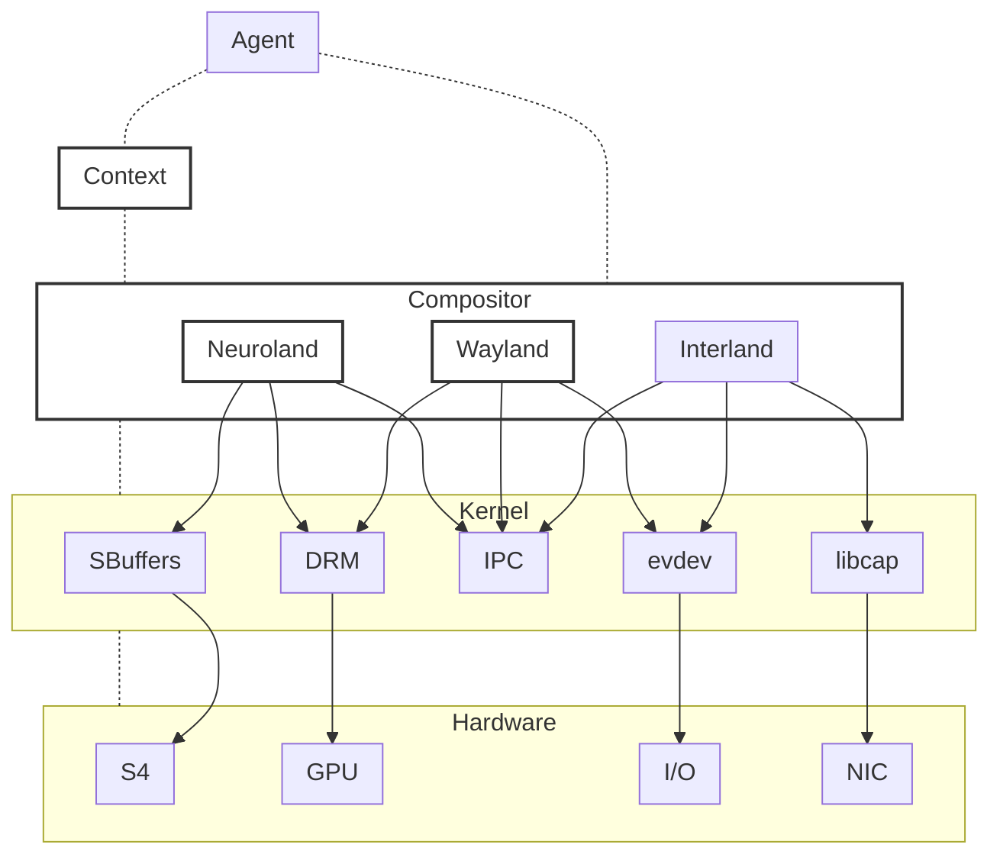

<!--
 Copyright 2023 Harmoniis Inc.

 Licensed under the Apache License, Version 2.0 (the "License");
 you may not use this file except in compliance with the License.
 You may obtain a copy of the License at

     http://www.apache.org/licenses/LICENSE-2.0

 Unless required by applicable law or agreed to in writing, software
 distributed under the License is distributed on an "AS IS" BASIS,
 WITHOUT WARRANTIES OR CONDITIONS OF ANY KIND, either express or implied.
 See the License for the specific language governing permissions and
 limitations under the License.
-->

# Abstract

**What Is It?**

**TLDR:** A universal context-derivable and self-improving  AGI agent approximated on analog computation at the intersection of symbolic architectures with neural network architectures. It is mainly built to run on top of FreeBSD in Jails like a desktop environment but ready to be extended to support NetBSD, OpenBSD, Linux, OpenXR, macOS, iOS, Android, or WSL in different packagings.

## Understanding its purpose

It might seem confusing why it run a Wayland compositor, resembles a game engine, a Wolfram Alpha or a desktop environment. Let's clarify with some analogies:

1. **Not a Typical Desktop Environment:**
   - Unlike GNOME or KDE, this environment operates more like a 3D game engine. It supports plugable advanced physics, math, biology, and chemistry models, rendering models, and sim2real/real2sim interfaces, all standardized for creating highly portable Real2Sim/Sim2Real environments for the AGI agents.

2. **More Than a Wayland Compositor:**
   - While a classic Wayland compositor manages displays, input devices, and window compositions, here we go further by managing sim2real and real2sim interfaces, agent inputs/outputs, and the neural network interface with hardware.

3. **Beyond a Game Engine:**
   - Unlike traditional game engines like Unreal or Godot that focus on Euclidean space, this project explores the entire physics spectrum. It's designed with quantum fields theory in mind, pluggable space topologies, and structure built through functional synthesis discovered with fractals, reaction-diffusion, chemistry, and electromagnetic fields. Environments are designed for generation by AGI agents, not imperative editing. Render algorithms here don't obey just QED, QFT, and General relativity; they go beyond.

4. **More Than Wolfram Alpha:**
   - While Wolfram Alpha is a knowledge engine, this project aims to interact with physical realities and render them for AGI agents to experience. It's a context engine empowering AGI agents to understand models, laws, and constraints as we do with physical laws in reality.

5. **Beyond a DNN framework:**
    - Unlike TensorFlow or PyTorch, this is a highly opionated, minimalist framework designed to infere high order wave functions for complex vector space (fields theory), not weights. Backpropagation is not made classicaly with auto differentiation, but with functional and Lorentzian differentiation computed in the analog domain with the S4 AGI accelerator. Input and output are not tensors but wave functions (signals), and the neural network architecture is different. Networks and subnetworks are dynamically built as logistic maps that can become dynamically very deep and very wide networks depending on the complexity of the input. The goal is to observe and map the building and breaking of symmetries by detecting Lorentzian invariance and Lorentzian covariance in the input and output signals under Lorentz transformations.

## Compatibility & Requirements

It works across multiple platforms like FreeBSD, OpenXR-conformant platforms, Linux, NetBSD, iOS, Android, macOS, WSL, and various hardware architectures (x86, x86_64, ARM, ARM64, RISC-V, etc.). It's compatible with classic mobile devices, TVs, VRs, infotainment systems, avionics control systems, and more.

There are two important considerations:

1. AGI agents require our S4 AGI accelerator.
2. Rendering environments demands a GPU with Vulkan or Metal support, and for achieving realism, the S4 AGI accelerator is necessary.

**Why Not Use Existing Tools?**

This project is driven by a clear mission: to build an AGI agent capable of successfully experiencing, solving, and navigating a wide range of environments and contexts that can be transferred into reality. Achieving this goal requires a high level of complexity, integration, and optimization, making abstraction or adaptation impractical. We are not reinventing the wheel, but we refuse to hack an existing game engine into an AGI agent within the current paradigm. The goal is to leave behind the legacy UI/UX paradigms and, as traditional editors, desktop environments, and other legacy paradigms limit design space.

This project adheres to two critical design and architecture principles:

1. The Vitruvian principle of architecture: "Beauty is founded in utility and firmness."
2. Alan Kay's famous principle of design at Xerox PARC: "Make simple things simple and complex things possible."

